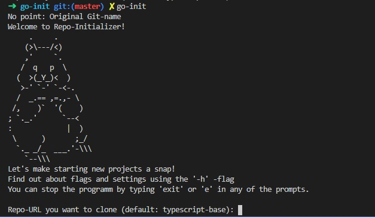
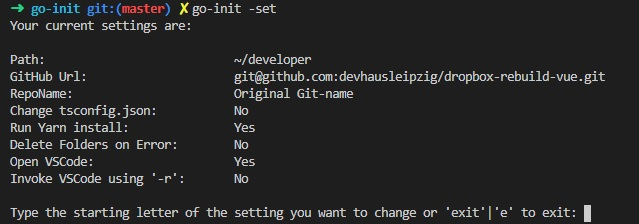

# Repo-Initializer

    A neat tool to automate setting up a new Git Repository making use boilerplates
    even more comfortable.

## Requirements:

    Bash, Node, npm or yarn, VS Code (optional)

## How to set up

    - Clone this Repository
    - cd into it
    - run 'yarn install' or 'npm install'
    - run 'yarn build'
    - run 'sudo npm install -g .' or 'sudo yarn global add $(pwd)'

    Check if everything worked out by using 'which go-init'. When you are given a path you are ready to roll.
    If not something went wrong und you may try again.

    That's it you now can run it from anywhere using the command 'go-init'

    When you desire to change the command to something else you can do so by changing
    the 'bin'-setting in the package.json befor globally installing the tool.

## How to use

    You can run Repo-Initializer just by it's command 'go-init' and then answering the prompts.
    Just hitting 'Enter' will use the defualt setting. 'exit' or 'e' stops the programm.

    Use the '-h' flag for getting to view the help-page.

    To configure the settings use the '-set'-flag like so:
        'go-init -set'
    You will be able to change the default settings by following the instructions.

    When you already checked the default settings you can simply use the '-q'-flag for a quick-installation.
    This will run the programmm without the need for an input, just relying on the settings.
